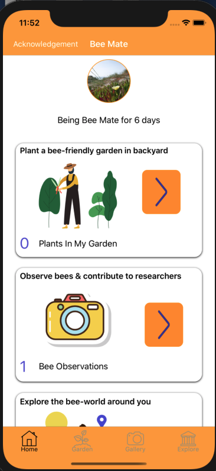
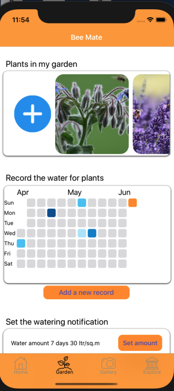
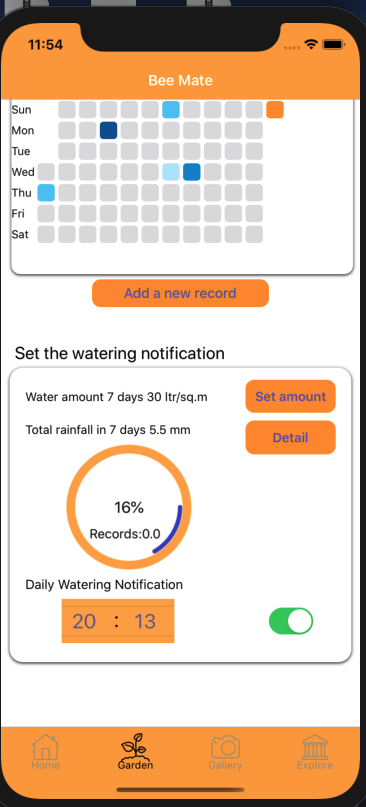
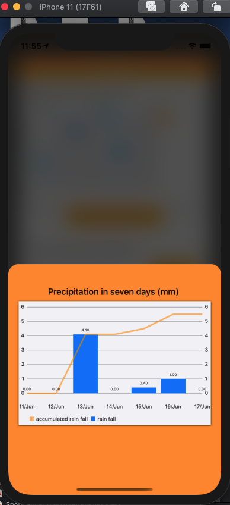
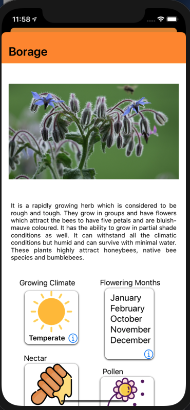
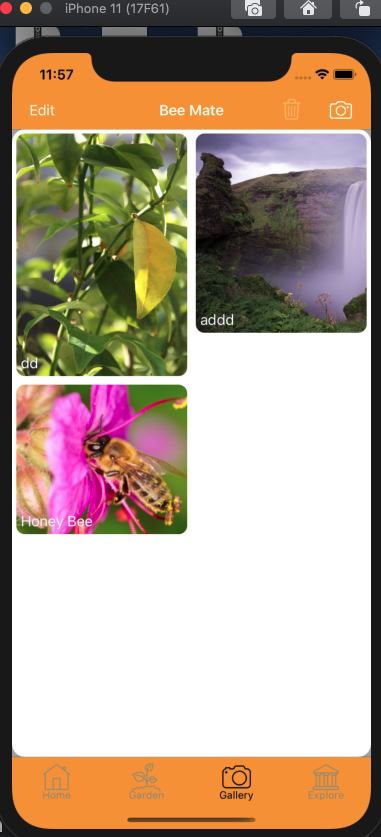
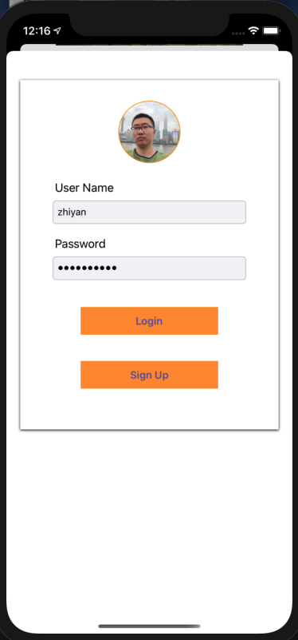
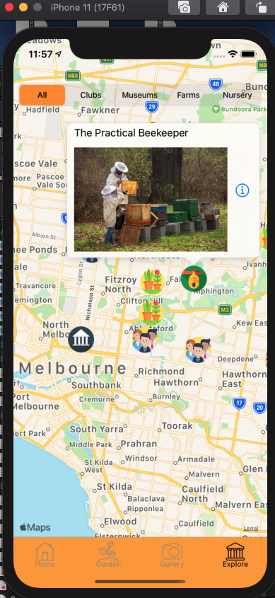

# BeeGarden

This is a project for completing the FIT5120 Industral Experience unit, useing Swift 5.0 and UIKit in Storyboard.
It includes the usage of many basic libraries, can be helpful for people in a entry level to learn basic iOS UI.

home page for overview functions and navigate, using Lottie animation

garden page for displaying plants in the garden, record watering, set watering notifications

 
  

  
previous 3 days and 3 days forecast rainfall data fetched from OpenWeatherMap API

plant detail page

observation gallery page to store the images in CoreData

login page for iNatulist account, for uploading the observations to iNaturlist.

map page for showing nearby spots by different icons and type filter.

